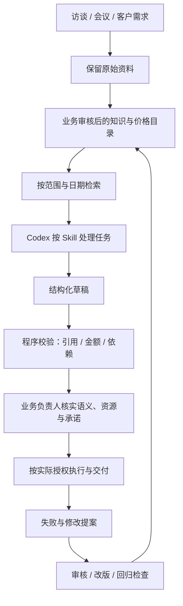

# 企业全员 AI 化：从业务知识到可运行工作流

> **配套可运行项目：** [ai-workflow-playbook](https://github.com/ChouchouPareto/ai-workflow-playbook) · [交给 Codex 的启动任务](https://github.com/ChouchouPareto/ai-workflow-playbook/blob/main/BOOTSTRAP_FOR_CODEX.md)
>
> 业务负责人可以先读第一至十二部分；搭建人员重点看第十三至十九部分。代码提供本地检索、会议行动校验、模块报价和失败提案三个业务示例，资料全部为虚构数据。它是可改造的工作流起点，实际经营效果需要在自己的团队中验证。

企业的 AI 应用会经历几种不同状态：有人尝试工具，有人能独立交付复杂任务，有人把成功经验写成工作流程，团队开始共享知识和标准，最后让每次工作都能改进下一次工作。

这些状态之间有实际的门槛。工具安装、信息整理、质量判断、同事协作和知识维护，都需要专门设计。全员 AI 化要把这些环节连起来，使个人能力的提升逐步进入组织的日常运作。

## 一、把转型拆成能够逐步推进的路径

| 阶段 | 主要动作 | 要形成的结果 |
| --- | --- | --- |
| 负责人亲自上手 | 选择熟悉的真实业务，参与输入、生成、修改和验收 | 知道工具能做什么，限制在哪里 |
| 让员工开始使用 | 现场完成安装配置，提供低门槛入口和身边的任务 | 每个人至少完成一次实际操作 |
| 培养业务骨干 | 找到愿意持续尝试的人，配置专业工具 | 在具体业务中形成可重复的做法 |
| 建立共同知识 | 解释当前业务、历史取舍和未来目标，审核后归档 | AI 和员工能调用一致的业务依据 |
| 固化质量与流程 | 把成功样例、修改意见和失败经验写成规则 | 同类任务有明确步骤和验收条件 |
| 重组团队协作 | 明确资料维护、任务分工、结果交接和访问范围 | 个人产出能被其他人接续 |
| 持续学习与更新 | 将新知识映射到业务，再以实际结果修订认知 | 知识、流程和人的能力一起更新 |

这些阶段可以交叉推进。先跑通一个任务，再围绕它积累资料和标准，会比一开始建设覆盖全公司的庞大系统更容易发现问题。

负责人亲自使用的重要性，在于取得足够的判断能力。当员工提出一个工具方案，负责人需要理解它会改变哪个环节、依赖哪些信息、结果由谁确认。这样才能调度工作，也能发现团队把时间消耗在了哪里。

## 二、员工采用 AI 的完整路径

### 1. 先完成安装和第一次操作

员工听懂演示，并不意味着回去后会主动安装工具、配置账号并完整跑一遍流程。对不熟悉的人来说，这些操作本身就构成了阻力。

因此，培训可以直接安排在真实工作环境里：一起完成配置，一起打开工具，一起跑通一个本来就要做的任务，现场解决权限、输入、格式和理解上的问题。

第一阶段的结果应当具体到“员工完成了什么”，而非“员工参加了什么”。

### 2. 把入口放进熟悉的沟通方式

使用成本包括心理负担。单独打开一个新软件、组织一段完整提示词、输入一份正式日报，都可能让人拖延。

把入口放进日常使用的协作工具，让成员像发送消息一样表达工作进展和问题，可以减少切换成本。语音特别适合现场人员报告情况，也适合业务负责人解释自己熟悉的经验。

语音输入后，仍要有核对过程：重要名称、时间、数量和承诺需要确认，零散表达也需要被整理成可使用的记录。

### 3. 从即时反馈进入专业流程

完整的推广顺序可以是：

**引起兴趣 → 轻量任务体验 → 获得实际帮助 → 找到积极使用者 → 配置专业工具 → 固化流程 → 让其他同事复用。**

早期可以选择封面制作、资料整理、会议回顾等能迅速看到结果的工作。员工愿意持续使用后，再围绕岗位推进更复杂的任务。

专业工具的配置应当跟随业务需求。内容工作、项目跟踪、产品定义有不同的输入和产物，不必让所有岗位采用同一套操作方式。

推广中还要观察两种问题：有人迟迟不开始使用；有人使用熟练后，把工作全部留在个人与 AI 的对话里。后一种情况需要进一步建立共享资料和交接机制。

## 三、知识库的起点：建立当前业务认知

### 1. 先确认现在，再整理过去

同一款产品可能经历多次价格调整，早期定位也可能与当前策略不同。把多年宣传稿、会议录音和内部文档混在一起，会让不同阶段的信息同时进入回答。

知识库首先需要一个明确的业务起点：

- 当前服务哪些客户，解决哪些问题。
- 当前有哪些产品、配置、价格和销售状态。
- 行业与竞争格局怎样，企业如何判断自己的位置。
- 哪些目标正在推进，哪些事情暂时不做。
- 产品路线、供应链安排和资源投入为什么这样选择。
- 历史上哪些判断已经被修正，哪些经验仍然适用。

过去的资料围绕这个起点逐步整理。旧版本可以保留，但需要明确对应时期和适用范围。

### 2. 业务判断需要由掌握业务的人提供

擅长 AI 的人能够整理资料、建立索引和搭建工具，但不一定知道某个产品为什么降价、某个供应商为什么被停用，也不一定知道哪些历史宣传已经不适合继续引用。

因此，业务负责人需要亲自解释方向、理由和关键例外，并审核整理结果。辅助人员和 AI 承担转写、归类、对照和维护工作，双方共同完成知识建设。

这里真正需要留下的，是决策背后的上下文。只有产品参数和公司介绍，仍不足以支撑复杂业务判断。

### 3. 用动态追问完成知识访谈

知识访谈可以按以下方式运行：

1. 确定当前业务范围与时间点。
2. 将认知拆成行业、客户、产品、竞争、供应链、经营目标等模块。
3. 让 AI 提出当前最有价值的一小批问题。
4. 负责人用语音回答，尽量包含理由、实际例子和不适用情况。
5. 转写后交给 AI 归纳，再由负责人核对。
6. 根据回答发现的新信息，重新生成下一批问题。
7. 持续调整目录和关联关系，形成当前有效的认知文档。
8. 用实际任务检验，再补充知识与修正规则。

每轮可以先回答约10个问题。一轮回答可能就会改变后面的问题，因为 AI 开始知道企业真正面临的矛盾、负责人采用的判断依据和此前没有说明的限制。

问题越贴近业务，回答越具体；输入的信息越充分，下一轮追问也越有针对性。访谈的进展应当体现在关键判断越来越清楚，而非完成了一份固定题目清单。

## 四、让知识成为 AI 能够调用的结构

### 1. 原始资料、业务理解和生成结果分开保存

一个可持续使用的项目目录，可以包含以下内容：

```text
项目或业务模块/
  01-原始资料/
  02-已审核的业务理解/
  03-生成结果/
  04-任务提示词/
  05-模板与规则/
  06-失败案例与修订记录/
  索引.md
```

原始资料保留来源，业务理解保存审核后的结论，生成结果对应具体任务。提示词、模板和规则负责让做法能够复用，失败记录则解释规则为什么变化。

文件夹数量可以调整，关键是让不同性质的内容有明确状态，避免把一次生成的草稿当成长期事实反复调用。

### 2. 新内容进入知识库，需要完成四个动作

**归入已有框架 → 与历史观点建立联系 → 拆解其中的判断 → 落到具体业务。**

例如，新增一篇关于产品定价的材料，应当说明它涉及哪个产品、与现有定价判断是否一致、成立需要哪些条件，以及会影响什么实际决定。

如果只是把文章存进去，后续调用仍需要重新解释业务联系。把这一步提前做完，知识才能逐渐构成可复用的上下文。

### 3. 维护索引、版本和使用范围

每个模块至少要说明包含什么、从哪里进入、哪些内容当前有效，以及与哪些模块有关。重要条目还应记录更新时间、来源、审核人和访问范围。

通过真实查询检查这些结构：同一个问题是否会得到互相冲突的答案？能否找到有效版本？依据是否可追溯？相关但权限不同的内容是否仍保持各自的访问范围？

知识库会在这些调用中持续修订，成为日常工作的一个组成部分。

## 五、把专家反馈变成标准、Skill 和工作流

专家的判断常常出现在修改动作里：某个术语错了，某个镜头不该放在这里，某项需求没有体现，某种表达不符合品牌口径。

这些意见如果只作用于当前交付物，下一次还需要重新指出。可以将它们持续收集起来，转成可重复调用的规则。

### 1. 从批注中积累规则

以内容校对为例：

**收集审片批注 → 保留错误与修改后的对照 → 按问题类型归类 → 写成检查规则 → 放入后续任务 → 继续收集遗漏。**

规则可以覆盖常见错字、术语、人名、表达方式和结构要求。每次执行任务前调用，完成后再检查。业务负责人的注意力因此能够逐步转向新的问题。

### 2. 写清四类输出标准

| 标准 | 应当具体到什么程度 |
| --- | --- |
| 格式 | 必须包含哪些模块，采用什么顺序，哪些字段不可缺少 |
| 长度 | 输出用于什么场景，需要多详细，篇幅如何控制 |
| 语气 | 提供认可的正例和不合适的反例，说明差别 |
| 禁止项 | 哪些信息不能编造，哪些内容不能省略，哪些承诺不能自行作出 |

先积累一批同类任务，从被认可的结果中找出共同结构，再写入模板和提示词。将真实失败案例补进去，标准会更容易被执行。

生成后可以让 AI 对照标准逐项检查，但关键事实与正式交付仍由相应负责人验收。标准要包含检查依据，避免只让模型给自己打一个分数。

### 3. 区分几种可复用资产

| 资产 | 主要作用 |
| --- | --- |
| 知识库 | 提供业务事实、经验和判断背景 |
| Prompt | 说明当前任务、输入、约束和输出要求 |
| Skill | 把某类任务的方法、规则和参考材料组织成可调用能力 |
| Workflow | 规定步骤、顺序、分工、检查和交接 |
| Agent | 在给定目标、工具和权限范围内推进任务 |

这些名称的具体实现会随工具变化，任务依据、质量标准和职责边界仍然需要明确。

## 六、六类值得展开的业务工作流

### 1. 产品开发：从可交互原型反向生成规格书

先提供现有产品资料、供应商样板和业务需求，让 AI 拆解功能并生成可交互界面。产品与技术人员围绕界面讨论，确认功能、状态和操作方式，再据此形成规格书。

仪表场景可以检查开机、导航、固件更新、消息提醒、音乐展示、速度及其他数据的显示。可讨论的界面让参与者更容易指出缺失和误解。

完整路径是：

**现有资料与样板 → 功能拆解 → 交互原型 → 短会确认 → 反向生成规格书 → 专业审核与修改。**

这里要分别记录初稿生成、专业检查和最终验收的时间。原型很快生成，仍可能需要数天核对功能边界和工程限制；生成时间不能代替完整产品开发周期。

### 2. 复盘会议：独立表达，汇总后再讨论

全体成员先通过语音分别表达观察和建议，AI 汇总为文档，负责人核对与修改，再在会议上同步并处理分歧。

除了节约逐人汇报的时间，这种方式还保留了独立表达的机会。成员不用先听到上级或其他人的判断再发言，也更容易提出不方便当众讨论的问题。

汇总应保留事实、观点、分歧和建议之间的区别，重要少数意见需要能回到原始记录。会议最终形成行动安排，并明确后续怎样检查。

### 3. 风险报告：让不同岗位的判断及时进入决策

一线人员可能掌握项目负责人没有充分看到的现实约束，也可能因为同事关系而不愿直接提出反对意见。

通过低门槛的对话入口，可以让成员说明：哪里存在风险、依据是什么、会影响什么、建议怎样处理。系统汇总后交给有能力协调资源的人核实和决策。

**现场观察 → 风险与依据 → 建议措施 → 核实分歧 → 管理介入 → 结果跟踪。**

这里的组织价值是让问题更早被看见。是否改善交付，还取决于后续行动及现实条件。

### 4. 供应商会议：会前生成协作页面，会后补全执行记录

会前调用知识库中的技术问题、历史承诺和失败记录，生成带有目标、议题、待确认项和责任字段的会议页面。

会中沿着页面逐项讨论、确认和填写。会后依据录音补齐细节，由相关人员确认，再输出完整材料给合作方，同时回写知识库。

页面可以采用表格，也可以采用可交互网页。重要的是同一份材料连续承接会前准备、现场讨论、会后执行和下一次查询。

合作方能够直接知道下一步交付什么，减少双方分别整理、重复确认和重新解释的工作。

### 5. 销售方案：服务模块、工时、价格与排期联动

现场记录客户需求，结合已有服务模块生成方案。每个模块包括工作内容、投入人力、工时、价格、交付物及依赖条件，让客户选择和调整。

当客户改变模块组合或实施周期时，重新生成对应排期。例如，从一个月改为一周，需要同步调整范围、每日安排和资源投入，不能只修改时间标题。

**需求沟通 → 确认需求 → 模块匹配 → 交互方案 → 调整组合 → 核对价格与能力 → 正式发出。**

方案生成、正式报价、客户确认和签约，是不同的节点。使用 AI 后，应分别观察这些节点的变化。

### 6. 经营复盘：用真实背景检验默认假设

当企业提出降本问题时，需要同时提供费用、业务规模、场地用途、生产方式和现实困难。AI 才有条件发现值得检查的异常项。

例如，租金问题可能同时涉及场地面积、楼层搬运、生产布置和办公需求。重新讨论这些条件后，才可能形成调整方案。

谈判过程中，也可以持续输入双方已经表达的条件，让 AI 帮助整理立场、比较选择和准备回应。重要数据与外部对比需要核实，承诺由负责人确认。

## 七、把失败记忆放进下一次工作

三年前解决过的问题，可能随着人员变化和记忆淡化再次出现。重新启用一个供应商或生产流程时，只记得曾经合作过，未必记得当时为什么返工。

失败记录应当包含：发生条件、实际问题、证据、已确认原因、修复方式，以及再次使用该流程前必须完成的检查。

可以将一次组装复盘转成进场准备、内部人员安排、核心人员培训、样品确认和首批检查等动作。随后更新出厂管控表，并让下次项目在启动时就调用这些要求。

完整路径是：

**问题发生 → 共同复盘 → 确认原因 → 写出预防动作 → 更新流程与检查表 → 下次触发时调用 → 检验效果。**

复盘最重要的产物，是下一次工作会实际执行的变化。把会议录音存进文件夹，只完成了其中的一步。

## 八、建立三层学习机制

外部知识进入企业后，还需要经过业务解释与实践验证。

### 第一层：理解外部知识

对高质量长内容进行转写、拆解和对照，识别问题、观点、论据及成立条件。把新内容与已有资料连接，保留不同观点之间的一致和冲突。

### 第二层：形成自己的业务解释

负责人结合企业经营给出反馈：哪些观点适用，哪些条件不满足，哪些内容会改变产品、销售或管理判断。

把这些反馈记录下来，外部概念就与企业自己的问题建立了联系。后续调用时，可以直接看到它为什么与当前业务有关。

### 第三层：由团队拿到真实任务中验证

员工使用这些理解解决问题，记录有效之处、失败条件和新的例外，再更新知识库。

**外部观点 → 企业理解 → 业务实践 → 实际反馈 → 新的企业理解。**

内容生产也可以嵌入这个过程：输入长内容和相关资料，生成带引用位置的结构与剪辑稿，人工选择保留部分、补充业务反馈，最后形成对外表达和内部知识。

对外分享能够展示企业正在做什么，也为具有相近工作方式的人提供了解团队的机会。

## 九、人才能力：审美、调度、交付、主动性

### 审美力：知道结果还能怎样变好

审美包含内容、逻辑和业务判断。一个人需要能识别产出中的重要缺陷，给出具体修改意见，并判断什么时候已经达到要求。

同样的能力也用于改善流程：发现哪个步骤重复，哪个环节仍在消耗人工，哪些经验能够提前写进标准。

### 调度力：把人与工具组织成一次交付

需要判断任务怎样拆、工具怎样选、哪些部分可以并行、哪些部分必须先确认，以及结果怎样交到下一位同事手里。

当一个人能推动多个任务时，还需要控制任务之间的依赖和验收负担，避免只有大量生成结果，却没有完成的项目。

### 交付力：在质量与时间之间作出明确取舍

AI 很快给出较完整的初稿，容易让人不断追求更好的版本。接近完成时，局部改进可能消耗越来越多时间。

任务开始就需要规定关键验收条件和截止时间。影响事实、价格和承诺的缺陷必须解决；可以继续打磨的细节则进入后续版本。

### 主动性：持续发现和推动值得做的事

主动性表现为发现重复问题、提出改进、尝试工具、整理经验和分享方法。AI 扩大了一个人推进这些工作的能力，也更需要人自己确定值得投入的方向。

对已有经验的员工，还需要帮助他们渡过旧方法熟练、新方法陌生的阶段。业务能力和工具熟练程度应当分别观察，再安排针对性的支持。

## 十、转型中的三类组织困难

### 1. 个人效率提高，协作难度却可能增加

成员之间的产出节奏和工作方式变化后，原来的岗位边界与分工可能不再合适。熟练使用者觉得交接麻烦，其他人感到自己被排除，跨部门合作也可能失去共同语言。

负责人需要组织共同上下文：共享业务目标、资料、标准和结果，各自维护相关部分，并明确交接要求。

共同协作空间中的 AI 助手可以作为一种探索，但群聊中出现机器人，并不能证明团队协作已经建立。仍需要检验谁参与、哪些信息被确认、结果如何归档、责任如何承接。

### 2. 改进机会增加，交付容易被推迟

工具快速变化，同一任务总有新的做法可以尝试。团队可能不断修改，却迟迟没有完成一个稳定版本。

应当给当前交付明确范围和时间，把更好的想法记录到下一轮。验收通过的版本先进入业务，再以实际反馈决定是否继续优化。

### 3. 新人的成长路径需要重新设计

过去由新人完成的资料整理、初稿和基础分析，可能有相当部分进入 AI 工作流。企业需要重新安排新人怎样学习业务、形成判断并承担结果责任。

一种可以继续设计的路径，是让新人解释 AI 的依据、检查错误、处理例外、跟进任务结果，逐步接手完整交付。具体效果需要实践检验，不能仅凭工具可用就假定新人已经具备业务能力。

转型还会消耗负责人和骨干的时间，可能伴随短期业务波动及角色调整。要把这些投入计入计划，给知识维护、流程改善和同事辅导明确安排。

## 十一、信任与权限决定知识能否真正共享

员工分享经验，也意味着把自己长期积累的方法交给团队；记录失败，则意味着让别人看到自己的判断失误。企业需要让成员理解这些工作的用途，并把分享和维护纳入实际贡献。

负责人也面对类似问题：新的维护人员为了完成任务，可能需要较全面的业务背景，而双方的信任还在建立。

可以围绕任务划清访问范围，让相关人员获得足够上下文，同时保留不同信息的权限边界。共享知识、维护资料、审核修改和对外发布，也可以是不同的职责。

知识越容易被复制，组织越需要在持续协作和更新上投入。一个静态文件集合无法自行判断新的客户需求、现场变化和项目结果，需要团队不断解释和修订。

## 十二、把内部改进延伸到外部协作

AI 应用可以从企业内部延伸到客户与供应商之间。

当企业能主动准备需求说明、技术问题、方案比较、行动记录和执行清单，合作方就能减少整理与确认的成本。企业承担更多信息组织工作，也可能让合作更顺畅。

这里存在一条值得探索的路径：

**内部知识与流程改善 → 对外材料更清楚 → 合作方更容易执行 → 获得更多现场反馈 → 继续完善业务知识。**

进一步形成行业协作优势，还取决于产品、资源、交付质量和持续合作，不能仅凭建有知识库就判定。

企业也需要识别自身能力与 AI 能力的结合点。内容整理、文书和分析可以得到工具支持，现场生产、供应链关系、产品体验和实际交付仍需要相应的业务投入。

最终值得观察的是：同样的任务，团队是否越来越容易完成；新的问题，是否能调用已有经验更快作出判断；发生过的错误，是否真正减少再次出现。


## 十三、将方法变成一套能维护的技术栈

技术栈首先要回答五件事：业务依据放在哪里，怎样找到有效依据，AI 按什么方法工作，哪些结果由程序校验，以及最终由谁接续执行。

| 层次 | 本地起步方案 | 负责什么 | 何时需要升级 |
| --- | --- | --- | --- |
| 原始输入 | UTF-8 文本、Markdown、JSON | 保存会议、需求、业务访谈和价格目录 | 录音量大时接入语音转写；扫描件先 OCR 并核对 |
| 业务知识 | Markdown + manifest.json | 来源、负责人、版本、状态、范围和有效期 | 多人维护冲突频繁时引入私有文档系统或数据库 |
| 检索 | SQLite FTS5 + 中文双字切分 | 找出可引用的当前知识片段 | 同义表达漏召回影响业务时评估向量混合检索 |
| 工作方法 | 仓库中的五个 Skills | 访谈建库、检索写作、会议、报价、复盘 | 不同岗位有不同流程时分出明确的专业能力 |
| 任务执行 | Codex + 项目 AGENTS.md | 理解任务、调用脚本、写草稿、定位缺口 | 需要无人值守、多人并发时增加服务端执行层 |
| 确定性工具 | Python 标准库、Decimal | 金额、依赖、字段和证据位置校验 | 复杂排产或财务规则需接业务系统或专门算法 |
| 运行记录 | 内容摘要命名的 JSON 文件 | 记录输入指纹、结果、状态及复跑依据 | 长任务、排队和失败恢复需工作流引擎 |
| 质量检查 | unittest + 检索题集 + 人工审核 | 验证边界、回归失败案例和真实业务质量 | 持续积累真实任务集，再比较模型与检索策略 |

这套起步方案只依赖 Python 和具备 FTS5 的 SQLite。演示脚本没有模型接口，也不需要 API Key；真实理解和写作由读者已登录的 Codex 完成。Codex 的账号及使用额度仍由读者自己的配置决定。

方法适合先用明确步骤跑通。工作流中的条件、顺序和验收可预先确定时，简单组合更容易调试；需要灵活探索未知路径时，再给 Agent 更大的自主空间。这个选择与 Anthropic 对工作流和自主 Agent 的区分一致。[Building effective agents](https://www.anthropic.com/engineering/building-effective-agents)



图中的业务审核、交付和组织学习需要真实人员参与。仓库当前实现检索、三个业务任务的校验与结果存档，其他环节通过 Skills 和模板接续。

### RAG 和 Skill 各自解决什么问题

**知识库回答“依据是什么”，Skill 回答“怎么做”，工作流回答“先后顺序与交接是什么”。**

RAG 是检索增强生成：根据问题先寻找相关资料，再把依据交给模型生成回答。向量数据库是检索的一种实现；目录索引、全文搜索或混合搜索同样可以构成检索环节。

本项目的完整使用方式是“本地词法检索 → Codex 阅读证据 → 生成带引用的产物”。单独运行 `search` 只完成检索，单独运行 `demo` 只回放合成数据，并未执行模型生成。

Skill 适合保存业务步骤、反例、输出合同和工具用法，不适合塞进所有历史材料。正式价格变化时修改目录即可，不必重写整份 Skill；审查流程改变时修改 Skill，不应把流程变化伪装成业务事实。Codex 的 Skill 以 `SKILL.md` 声明名称和适用场景，按需加载详细内容与参考资源。[Build skills](https://learn.chatgpt.com/docs/build-skills)

`AGENTS.md` 则保存整个项目通用的工作约定，例如运行哪些检查、临时产物放在哪里、哪些资料属于任务数据。Codex 会按项目层级读取这些约定。[Custom instructions with AGENTS.md](https://learn.chatgpt.com/docs/agent-configuration/agents-md)

## 十四、先做好可追溯检索，再决定是否上向量数据库

### 1. 在切片之前解决知识状态

一个知识条目至少包含：唯一 ID、标题、路径、版本、来源、负责人、状态、使用范围和有效期。内容相似但适用时期不同的材料，要明确保留各自时间边界。

例如，“首批抽检1件”的旧规程与“首批10件逐件检查”的现行规程不能同时被当作当前标准。一次销售草稿写下“一天内交付”，也不能因为文件存在就进入正式口径。

代码默认只返回指定范围、已审核且当日有效的条目；正文或元信息变化后，旧索引会被拒绝使用，需要重建。每条命中包含原文、文件、版本与定位信息，让人能够查回依据。

### 2. 用适合材料的切片方法

整理过的业务知识通常可以按一段一个意思保存。当前实现按非空正文行切片，将文档标题加入检索词，避免“首批检查”脱离所属主题；它不会自动理解 PDF 布局、跨页表格或复杂章节结构。

中文连续文字需要额外处理。项目将连续汉字转成相邻双字词，例如“接插件”拆为“接插、插件”，英文和数字按词保留，再交给 FTS5 检索。它使用 BM25 排序，不包含 Embedding 或语义重排。[SQLite FTS5](https://www.sqlite.org/fts5.html)

这种方式成本低，也有清楚的局限：“返工”与“重做”可能没有词面重合；长问题可能只命中一个泛化词；多个返回片段可能属于同一文档。因此，检索结果只能作为候选证据，不能直接当成答案。

### 3. 在生成阶段检查证据是否足够

针对每个结论，检查证据是否真的支持它。例如搜索“一天内交付”命中一段“交期需确认”，只能说明交付条件仍待确认，不能得出已经可以一天交付。

输出中应明确区分：有依据的事实、根据事实作出的推断、需要补充的数据，以及尚未形成决定的问题。找不到依据时，列出缺失信息或请求负责人解释。引用必须来自实际查询，不能由模型拼接看起来像真的来源编号。

只把当前任务需要的内容交给模型，保留原文路径以便继续按需读取，可以减少无关上下文的干扰。这与按需加载上下文的工程思路相符。[Effective context engineering](https://www.anthropic.com/engineering/effective-context-engineering-for-ai-agents)

### 4. 用漏召回证据决定升级

先积累真实问题：用户问法、期望找到的文档、允许的范围、业务日期、实际结果及漏掉的原因。若问题主要来自同义词、口语表达或跨语言，再比较中文友好的 Embedding 加全文检索。

升级时可以采用两条路径：已有 PostgreSQL 的团队评估 pgvector；需要独立向量检索服务的团队评估 Qdrant。先用相同题集比较召回、延迟、维护成本，再决定迁移。[pgvector](https://github.com/pgvector/pgvector) · [Qdrant filtering](https://qdrant.tech/documentation/search/filtering/)

切片补充解释性上下文、词法与向量结合、再对候选结果重排，是可评估的进一步改进方向；不能直接把其他团队公布的实验收益视为自己的结果。[Contextual Retrieval](https://www.anthropic.com/engineering/contextual-retrieval)

多用户部署时，要在检索服务端从登录身份推导可见范围，先做授权过滤，再把结果交给模型。公开示例的 `--scope` 是本地选择参数，用户可以自己改，因此它不提供用户间的数据隔离。

## 十五、把三条工作流真正跑起来

### 工作流 A：从会议原文到有证据的行动

**输入：** 一行一段发言的原始记录。会前可先分别收集每个人的意见，再进入共同讨论。

**Codex 的任务：** 区分事实、建议、承诺与分歧，输出行动 JSON，每项带任务、负责人、期限、原文行号和引文。未确认日期写 `null`，不能为了清单好看而自行补齐。

**程序的任务：** 验证行号有效、引文确实出现在原文、负责人和日期有文字依据。程序不能证明行动的语义完全正确，例如一句“李工不同意周五交付”同时出现人名和日期，也并不构成承诺。

**负责人的任务：** 检查条件、否定和少数意见，确认行动确已被接受，决定尚未明确的责任与日期。回写采用新增确认记录，保留原始发言。

**产物：** 待审核行动 JSON、可阅读纪要、未决问题清单和来源指纹。下次会议检查上一轮动作是否完成。

### 工作流 B：从客户需求到模块化报价

**输入：** 客户目标、服务目录、模块数量、依赖条件、期望交期和已知资源限制。

**Codex 的任务：** 把需求映射到模块，解释交付物，指出目录中无法覆盖的内容。需要新增服务或例外折扣时交给目录负责人确认。

**程序的任务：** 检查目录有效期、模块价格、数量和依赖，使用十进制运算计算金额与工时。示例中需求澄清2000元、交互原型6000元、规格书3000元，合计11000元未税服务费、44工时。

**负责人的任务：** 核实范围、费用口径、供应条件与资源。客户期望7天，只能进入需求字段；还要检查前置依赖、等待评审和可用人员，才能讨论实际交期。

**产物：** 报价草案、目录版本、费用明细、排期缺口。客户勾选模块的交互网页可以作为下一阶段界面改造；当前仓库提供 JSON 输入和程序计算，未提供网页配置器。

### 工作流 C：从失败记录到下一次的检查动作

**输入：** 失败经过、原始证据、触发场景、现行规则和已知后果。

**Codex 的任务：** 提出可以在下一次任务中执行的预防检查。比如发生接插件反装后，提出恢复装配前核对方向、复核首批并留下照片，同时区分已观察现象与尚未证实的原因。

**程序的任务：** 检查必要字段与来源位置，把结果保存为 `proposed`。它不会修改正式知识，也不接受模型在字段中填一个审核人名字就完成审批。

**负责人的任务：** 验证原因与预防动作；确认后更新正式知识、版本和相应 Skill，再增加一条失败回归用例。下次任务触发时先查这条规则，观察它是否有效。

**产物：** 改进提案、知识差异建议、拟新增测试和业务效果观察记录。检查表更新只是开始，返工是否减少才是后续需要回答的问题。

### 其他场景如何接到同一套结构

| 场景 | AI 主要处理 | 程序或专业人员必须检查 | 当前配套程度 |
| --- | --- | --- | --- |
| 负责人访谈 | 动态追问、冲突归纳、草稿分类 | 业务事实、历史取舍与审核状态 | knowledge-onboarding Skill |
| 供应商会议 | 议程、待确认问题、会后行动 | 技术可行性、双方承诺和执行结果 | evidence-brief + meeting-actions |
| 产品规格书 | 原型描述、状态清单、规格初稿 | 工程可行性、接口、边界与测试 | 方法路径与模板，需按产品实现 |
| 风险报告 | 汇总独立意见、保留分歧与证据 | 管理决策、资源与交期影响 | 会议合同可复用，专门上报系统未实现 |
| 经营复盘 | 整理成本假设、比较方案和缺口 | 数据真实性、停工损失与约束 | 方法与访谈模板，未接财务系统 |

## 十六、让陌生团队和他们的 Codex 可以接手

可复刻的项目需要同时提供“读懂为什么”的入口和“知道现在做什么”的入口。

读者从文章理解业务路径，从 README 运行演示，再把 `BOOTSTRAP_FOR_CODEX.md` 的任务交给 Codex。Codex 读取项目约定和相应 Skill，按输入合同生成文件，执行程序检查，最后报告实际结果和缺口。

项目中的五项能力分别是：

- `knowledge-onboarding`：把业务经验转为有来源、有状态的知识条目。
- `evidence-brief`：检索知识，形成带依据的业务说明或供应商议程。
- `meeting-actions`：保留行动、责任、日期、分歧与原文位置。
- `quote-builder`：调用有效目录和计算程序生成报价草案。
- `failure-memory`：把失败转成待审核的规则与回归建议。

五个 Skills 使用共同的代码与合同，应当随整个仓库分发。只复制单个 `SKILL.md` 到别的项目，相关脚本和文档不会自动跟过去。

替换真实资料时，先在 `private/` 或独立私有目录建立工作副本。保留示例用于回归验证，逐步导入真实目录、业务认知、一个会议和一个失败记录。业务负责人审核当前事实后，再把它们设为正式可检索状态。

每个团队应当补齐四项约定：认可的输出样例、不可接受的反例、关键字段与不允许自行决定的事项，以及交付截止时间。这样 Codex 才能把抽象方法变成岗位可用的标准。

## 十七、用一个月建立可验证的采用路径

下面是一份可按节奏调整的试点安排。时间是计划建议，不是效果保证。

| 阶段 | 业务动作 | 技术动作 | 本阶段验收 |
| --- | --- | --- | --- |
| 第1周：一个真实任务 | 负责人和骨干一起完成安装、操作、修改与验收；记录原有耗时 | 跑通演示；建立私有资料目录；完成第一轮访谈 | 一个任务从输入走到可用交付，知道最主要的缺口 |
| 第2周：建立共同依据 | 负责人审核当前产品、价格、交付边界及失败规则 | 导入知识；建立有效期和引用；为常见问题写检索用例 | 当前与历史口径可区分，关键结论能回查 |
| 第3周：交给第二个人 | 新成员照着流程操作；记录不明白的步骤和修改意见 | 更新 Skill、正反例及输出合同；加入失败测试 | 换人后仍能完成，交接不依赖原操作者口头补充 |
| 第4周：进入日常工作 | 连续处理真实任务，追踪行动、返工和协作问题 | 比较基线；整理缺失能力；选择是否升级 | 有足够记录判断哪里有效、哪里还增加负担 |

先选输入较清楚、输出能验收、会反复出现的任务。高频会议行动和有固定目录的报价适合试点；自动承诺复杂工期、自动改变工艺参数等任务，需要更多专业约束。

团队推广继续沿着“轻量体验—积极使用者—专业工具—成功流程—同事复用”推进。管理者需要为审核和训练预留时间，新人也需要练习判断依据、发现错误与修正结果，而不仅是观看生成过程。

## 十八、怎样判断它有没有变好

至少分开记录四类指标：

| 维度 | 可记录指标 | 容易误判之处 |
| --- | --- | --- |
| 检索 | 正确依据是否进入前几项、过期资料是否被过滤、无答案时是否保留缺口 | 命中关键词不代表支持结论 |
| 交付质量 | 引文正确性、关键字段缺失、修改次数、金额错误 | 格式合格不等于业务正确 |
| 组织效率 | 从准备到审核的总耗时、等待确认时间、换人执行成功率 | 只统计模型生成时间会漏掉审核负担 |
| 业务结果 | 行动完成率、重复返工、方案修改周期、实际交付偏差 | 一次成功不能证明长期效果，更不能推出因果 |

给每个任务保存输入、生成结果、程序检查、人工修订与最终结果。把真实失败变成下一轮测试；自动评分与人工判断需要定期对照。这是针对任务建立持续评测的方法，而不是只看一份漂亮输出。[Evaluation best practices](https://developers.openai.com/api/docs/guides/evaluation-best-practices)

仓库附有结构与边界测试、六条合成检索题。它们用于验证代码是否按合同运行，不能代表某个模型的整体准确率，也不能替代企业自己的真实任务评测。模型生成、语义支持和遗漏问题仍需要专门记录与审核。

## 十九、从本地试点走向团队服务

当多名员工同时使用、需要长期执行、或要接入飞书和业务系统时，本地目录的边界就会显现。可以按需要逐层升级：

1. **统一入口与身份。** 用内部网页或协作工具提交任务，服务器核验用户身份和可访问业务范围。模型不能自行决定谁能看什么。
2. **集中存储和版本。** 在私有数据库或文档系统保存正式事实，保留审核人与变更记录；任务输出仍与正式知识分开。
3. **检索服务。** 将元信息过滤、全文或混合检索放在受控服务端，评估模型可见内容，记录所用证据版本。
4. **持续任务。** 将待处理、生成、校验、待确认、执行、失败等状态明确存储。LangGraph 等框架提供持久化与检查点能力，但仍需应用自己处理外部副作用与重复执行。[LangGraph persistence](https://docs.langchain.com/oss/python/langgraph/persistence)
5. **业务工具。** 先接只读的产品、库存和客户资料，再按实际授权接写入工具；每种写入定义必要字段、权限、幂等标识和失败处理。
6. **运营反馈。** 每周查看不能回答的问题、人工修正最多的字段、失败最多的工具和实际采用情况，用这些证据决定下一项投入。

本地项目没有实现多用户权限、录音转写服务、向量数据库、网页报价器、审批服务或无人值守发布。这些能力的引入应当由业务需求和测试结果推动。能持续维护共同知识、明确责任和质量标准，并让每次工作改进下一次工作的团队，才有条件把个人工具使用扩展成稳定的组织能力。

---

技术参考核对日期：2026-09-21。文中配置对应配套仓库当前实现；上游产品能力与文档可能继续变化。
